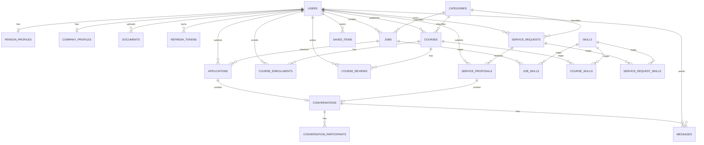
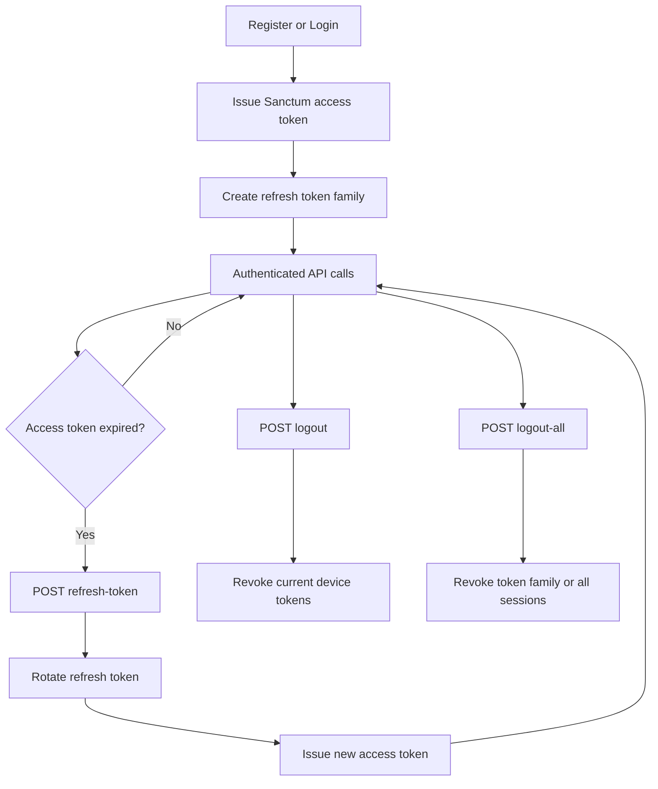
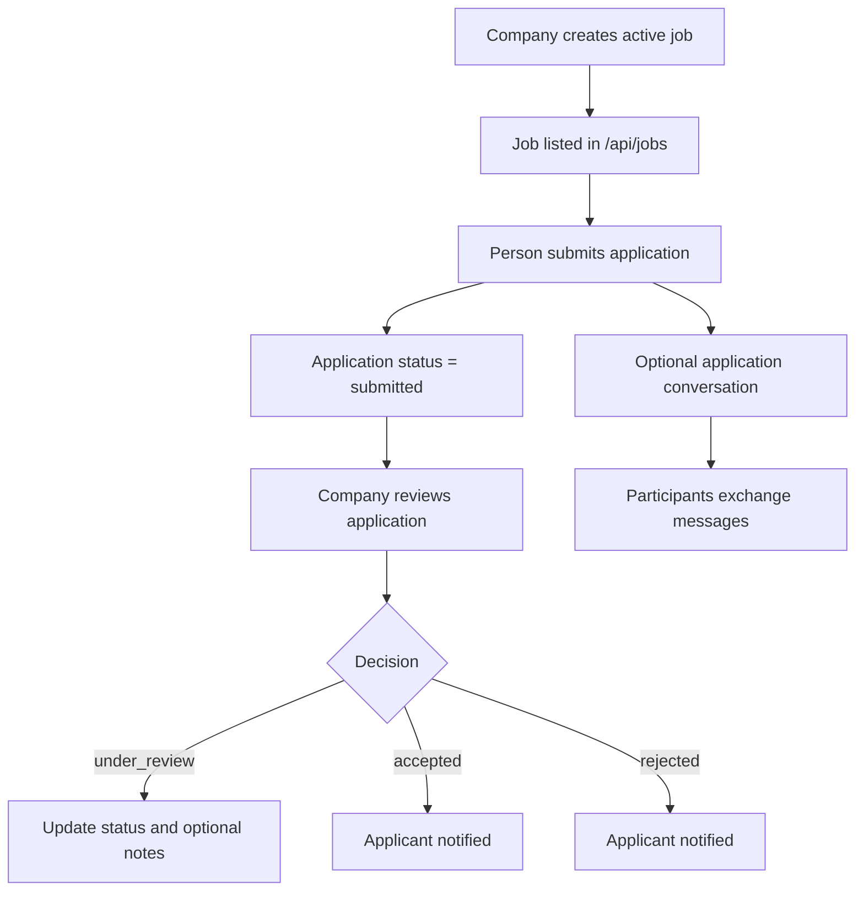
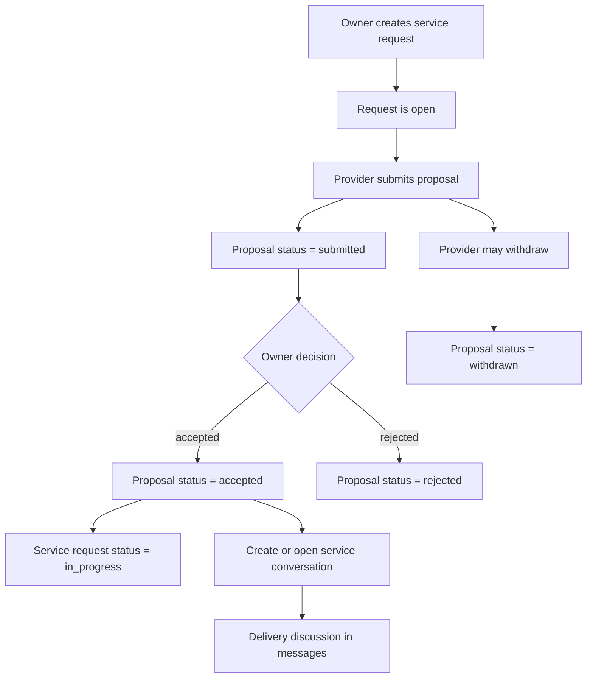
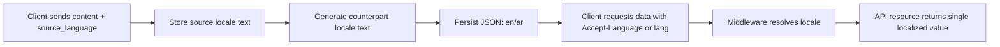
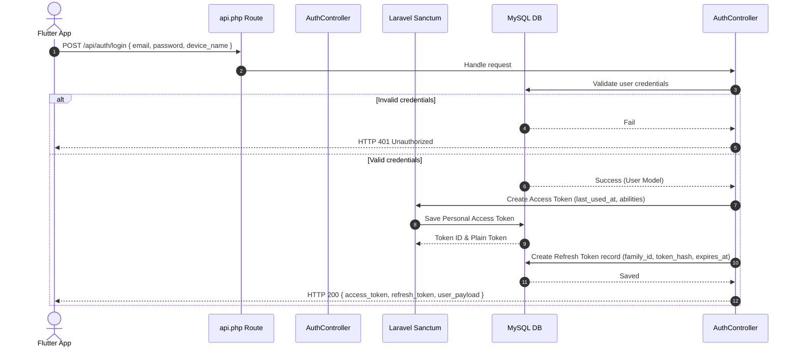
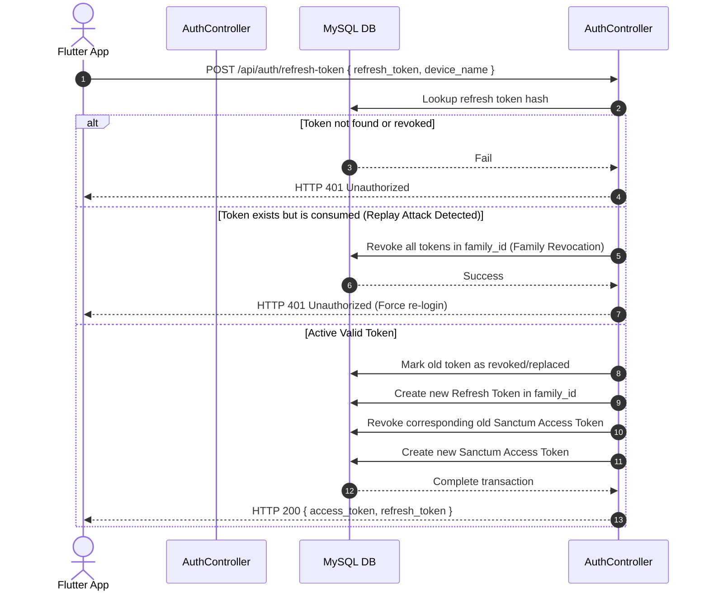
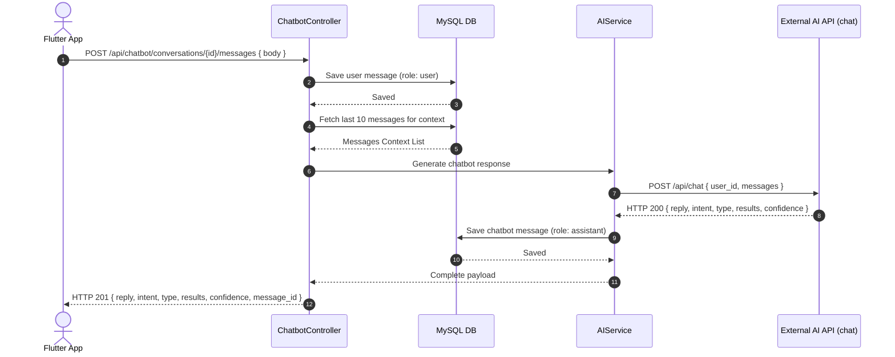

# JobNest Project Documentation

## Table of Contents

1. [Project Overview](#1-project-overview)
2. [System Architecture Summary](#2-system-architecture-summary)
3. [Database Documentation](#3-database-documentation)
4. [Implemented Project Features](#4-implemented-project-features)
5. [Conclusion](#5-conclusion)
6. [API Endpoints Reference](#6-api-endpoints-reference)
7. [Request/Response Examples](#7-requestresponse-examples)
8. [Flow Diagrams](#8-flow-diagrams)
9. [Request Lifecycle Architecture](#9-request-lifecycle-architecture)
10. [Validation Rules Reference](#10-validation-rules-reference)
11. [Error Handling Strategy](#11-error-handling-strategy)
12. [Authorization Matrix](#12-authorization-matrix)
13. [Pagination Pattern](#13-pagination-pattern)
14. [Filtering and Search Contract](#14-filtering-and-search-contract)
15. [File Storage Rules](#15-file-storage-rules)
16. [Performance and Indexing Notes](#16-performance-and-indexing-notes)
17. [AI Sync Lifecycle](#17-ai-sync-lifecycle)
18. [Core Business Rules](#18-core-business-rules)
19. [Rate Limiting Specification](#19-rate-limiting-specification)
20. [Token Lifetimes and Session Configuration](#20-token-lifetimes-and-session-configuration)
21. [Standard Response Envelope](#21-standard-response-envelope)
22. [Queued Jobs Reference](#22-queued-jobs-reference)
23. [Soft Deletes Policy](#23-soft-deletes-policy)
24. [Security Configuration Notes](#24-security-configuration-notes)
25. [Chatbot Context Window and AI Chat Flow](#25-chatbot-context-window-and-ai-chat-flow)
26. [Glossary](#26-glossary)
27. [Environment Variables](#27-environment-variables)
28. [Deployment Stack](#28-deployment-stack)
29. [Sequence Diagrams](#29-sequence-diagrams)
30. [Directory and Folder Structure](#30-directory-and-folder-structure)
31. [Testing Strategy](#31-testing-strategy)

---
## 1. Project Overview

JobNest is a Laravel 13 REST API for a multi-sided career and professional services platform. The system supports two primary account types, `person` and `company`, and organizes its business flows around account registration, onboarding, profile management, job publishing, job applications, training courses, service requests, proposals, conversations, messages, notifications, and saved items.

The API uses Laravel Sanctum for access tokens, a dedicated refresh token table for session rotation, Laravel notifications for in-app alerts, and database-backed messaging and queue infrastructure. Categories are shared across jobs, courses, and service requests, while skills, languages, and interests support profile enrichment and matching-oriented discovery flows. User-facing marketplace content is bilingual for Arabic and English through middleware-driven locale resolution and JSON-based translated content stored directly on the same business tables.

## 2. System Architecture Summary

- **Authentication layer:** email/password login, Google login, email verification, OTP-based password reset, Sanctum access tokens, refresh token rotation, and device/session revocation.
- **Localization layer:** API locale resolution is middleware-based and supports `en` and `ar` only. The request lifecycle checks `Accept-Language` first, then `lang`, then falls back to English. The installed Laravel localization package is used as the locale metadata source, while dynamic business content translation is handled by JobNest services and JSON columns.
- **User model:** one `users` table with `account_type` distinguishing `person` and `company`.
- **Profile layer:** `person_profiles` and `company_profiles` store account-type-specific onboarding and profile data.
- **Content and marketplace layer:** companies publish jobs; both persons and companies can publish courses and service requests.
- **Interaction layer:** applications, course enrollments, course reviews, proposals, saved items, and notifications connect users to published content.
- **Communication layer:** conversations, participants, and messages support direct chat, application chat, and service-proposal chat.
- **Support infrastructure:** sessions, cache, queue tables, failed jobs, notifications, and migration tracking support runtime behavior.

### 2.1 API Localization and Dynamic Content Translation

- **Supported API languages:** English (`en`) and Arabic (`ar`) only.
- **Locale resolution order:** `Accept-Language` header, then `lang` query parameter, then fallback to the configured default locale `en`.
- **Request lifecycle behavior:** middleware sets the Laravel app locale for the request and returns `Content-Language` on the response.
- **Storage model:** translated business content is stored as JSON in the same tables, for example `{ "en": "Data Analyst", "ar": "محلل بيانات" }`.
- **Create/update behavior:** translatable create and update endpoints accept a flat content value plus `source_language`. The submitted language is preserved as the source value and the missing counterpart is generated automatically by the translation service.
- **Fallback behavior:** if machine translation is unavailable or fails, the request still succeeds and the source text is stored safely as the fallback value for the missing locale instead of breaking the feature flow.
- **Response behavior:** normal API responses return only the currently resolved locale value for translatable attributes and do not expose the raw JSON translation object.

## 3. Database Documentation

### 3.1 Table: `users`

**Purpose**  
Stores the main account record for every authenticated platform user.

**Key Columns**

- `name`: display name used across the platform.
- `email`: unique login identity for standard authentication.
- `google_id`: unique external identifier for Google-linked accounts.
- `phone`: optional unique phone number, also used in OTP password reset.
- `account_type`: distinguishes `person` and `company`.
- `profile_photo`: stored path for the user avatar.
- `status`: account lifecycle state such as `active`, `inactive`, or `suspended`.
- `email_verified_at`: timestamp used by the verification flow and verified-only endpoints.
- `password`: hashed password for local authentication.

**Relationships**

- Has one `person_profiles` record for person accounts.
- Has one `company_profiles` record for company accounts.
- Has many `documents`, `refresh_tokens`, `jobs`, `applications`, `messages`, `courses`, `course_enrollments`, `course_reviews`, `service_requests`, `service_proposals`, and `saved_items`.
- Belongs to many `skills`, `languages`, `interests`, and `conversations`.
- Acts as the notifiable model for the `notifications` table.

**Business Use in JobNest**  
The `users` table is the identity anchor for the whole platform. Authorization rules, onboarding flow, session management, notifications, content ownership, and messaging all resolve back to this table.

### 3.2 Table: `person_profiles`

**Purpose**  
Stores person-specific onboarding and profile details.

**Key Columns**

- `user_id`: unique link to the owning user.
- `university`, `major`: education data collected during onboarding.
- `employment_status`, `employment_type`, `current_job_title`, `company_name`: employment context.
- `linkedin_url`, `portfolio_url`: external profile links.
- `preferred_work_location`: onsite, remote, or hybrid preference.
- `expected_salary_min`, `expected_salary_max`: salary expectation range.
- `about`: personal summary.
- `onboarding_step`: tracks onboarding progress.
- `is_profile_completed`: indicates onboarding completion.

**Relationships**

- Belongs to `users`.

**Business Use in JobNest**  
This table supports person onboarding, profile display, and profile editing, and works together with user skills, languages, interests, and documents to form the person-side professional profile.

### 3.3 Table: `company_profiles`

**Purpose**  
Stores company-specific profile and onboarding data.

**Key Columns**

- `user_id`: unique link to the owning user.
- `company_name`: primary company identity shown in the system.
- `website`, `company_size`, `industry`, `location`: organization profile data.
- `about`: company description.
- `logo`: stored path for the company logo.
- `onboarding_step`, `is_profile_completed`: onboarding state fields.

**Relationships**

- Belongs to `users`.

**Business Use in JobNest**  
This table powers company onboarding, company profile management, and the presentation of company-owned jobs and courses.

### 3.4 Table: `admins`

**Purpose**  
Stores administrator identities used to determine whether a user may manage platform reference data.

**Key Columns**

- `email`: matched against the authenticated user email.
- `status`: only active admin records grant elevated permissions.
- `name`, `phone`, `profile_photo`, `last_login_at`: operational admin profile data.

**Relationships**

- Checked indirectly from the `users` model through email matching.

**Business Use in JobNest**  
Admin presence is used by policies to authorize create, update, and delete operations on categories, skills, languages, and interests.

### 3.5 Table: `otp_codes`

**Purpose**  
Stores one-time passwords for account verification and password reset workflows.

**Key Columns**

- `user_type`: distinguishes the account domain using the OTP.
- `user_id`: associated user when applicable.
- `email`, `phone`: identifier used to send and validate the OTP.
- `code`: generated OTP value.
- `type`: `verify_email` or `reset_password`.
- `expires_at`: OTP expiration time.
- `verified_at`: confirms successful OTP validation before password reset.

**Relationships**

- Belongs to `users` through `user_id`.

**Business Use in JobNest**  
The current API uses this table for the forgot-password flow, including send, resend, verify, and consume behavior for email- or phone-based reset requests.

### 3.6 Table: `personal_access_tokens`

**Purpose**  
Stores Sanctum access tokens for authenticated API sessions.

**Key Columns**

- `tokenable_type`, `tokenable_id`: polymorphic reference to the authenticated model.
- `name`: token/device label.
- `token`: hashed token value.
- `abilities`: allowed abilities array.
- `last_used_at`, `expires_at`: session activity and expiry metadata.

**Relationships**

- Polymorphically belongs to the authenticatable model, which is `users` in this project.

**Business Use in JobNest**  
These records back bearer-token authentication, active session listing, token revocation, and device-aware session responses.

### 3.7 Table: `refresh_tokens`

**Purpose**  
Stores long-lived refresh tokens that rotate access tokens securely.

**Key Columns**

- `user_id`: token owner.
- `access_token_id`: linked current access token.
- `family_id`: groups rotated tokens into a refresh family.
- `replaced_by_token_id`: points to the next token in the rotation chain.
- `token_hash`: stored hash of the refresh token value.
- `name`: device label.
- `ip_address`, `user_agent`: device metadata.
- `last_used_at`, `revoked_at`, `expires_at`: lifecycle tracking fields.

**Relationships**

- Belongs to `users`.
- Belongs to `personal_access_tokens`.
- Self-references through `replaced_by_token_id`.

**Business Use in JobNest**  
This table enables refresh token rotation, family revocation, session replacement, logout of the current device, and logout from all devices.

### 3.8 Table: `documents`

**Purpose**  
Stores uploaded user documents such as CVs and certificates.

**Key Columns**

- `user_id`: owning user.
- `type`: `cv` or `certificate`.
- `title`: optional display title.
- `file_path`, `file_name`, `mime_type`, `file_size`: stored file metadata.
- `is_primary`: marks the active CV used by the user.

**Relationships**

- Belongs to `users`.
- Has many `applications` through `cv_document_id`.

**Business Use in JobNest**  
Documents are uploaded during onboarding and profile management. CV documents can be attached to job applications, and the API maintains a single primary CV per user.

### 3.9 Table: `skills`

**Purpose**  
Stores the platform-wide skill catalog.

**Key Columns**

- `name`: bilingual JSON skill name with `en` and `ar` values, returned as a single localized string in API responses.

**Relationships**

- Belongs to many `users`, `jobs`, `courses`, and `service_requests` through pivot tables.

**Business Use in JobNest**  
Skills are used in user profiles, job requirements, courses, and service requests. They also drive the new job notification audience by matching job skills to person profiles while remaining localized to one language per API response.

### 3.10 Table: `user_skills`

**Purpose**  
Pivot table linking users to skills.

**Key Columns**

- `user_id`, `skill_id`: unique user-skill pair.

**Relationships**

- Belongs to `users`.
- Belongs to `skills`.

**Business Use in JobNest**  
Supports profile skill management for users and powers job-notification targeting and discovery filters.

### 3.11 Table: `languages`

**Purpose**  
Stores the platform-wide language catalog.

**Key Columns**

- `name`: bilingual JSON language name with `en` and `ar` values, returned as a single localized string in API responses.

**Relationships**

- Belongs to many `users` through `user_languages`.

**Business Use in JobNest**  
Used to enrich person profiles and support language selection during onboarding and profile updates.

### 3.12 Table: `user_languages`

**Purpose**  
Pivot table linking users to languages.

**Key Columns**

- `user_id`, `language_id`: unique user-language pair.

**Relationships**

- Belongs to `users`.
- Belongs to `languages`.

**Business Use in JobNest**  
Stores the languages selected for each user profile.

### 3.13 Table: `interests`

**Purpose**  
Stores the platform-wide interest catalog.

**Key Columns**

- `name`: bilingual JSON interest name with `en` and `ar` values, returned as a single localized string in API responses.

**Relationships**

- Belongs to many `users` through `user_interests`.

**Business Use in JobNest**  
Used to capture person interests during onboarding and profile management.

### 3.14 Table: `user_interests`

**Purpose**  
Pivot table linking users to interests.

**Key Columns**

- `user_id`, `interest_id`: unique user-interest pair.

**Relationships**

- Belongs to `users`.
- Belongs to `interests`.

**Business Use in JobNest**  
Stores each user’s selected interests and completes the person-profile preference layer.

### 3.15 Table: `categories`

**Purpose**  
Shared classification table for jobs, courses, and service requests.

**Key Columns**

- `name`: bilingual JSON category label.
- `slug`: URL-friendly unique identifier within a category type.
- `type`: category domain, either `job`, `course`, or `service`.
- `description`: bilingual JSON presentation text.
- `icon`: presentation metadata.
- `is_active`: controls whether the category is available in active listings.

**Relationships**

- Has many `jobs`, `courses`, and `service_requests`.

**Business Use in JobNest**  
The category model unifies taxonomy across the three marketplace modules while keeping type-scoped validation and filtering, and its localized values are resolved to one response language at a time.

### 3.16 Table: `jobs`

**Purpose**  
Stores company-created job opportunities.

**Key Columns**

- `company_id`: owner company user.
- `category_id`: shared category reference for job classification.
- `industry`: optional string describing the industry vertical the job belongs to (for example `FinTech`, `Healthcare`, `Technology`).
- `title`, `description`: bilingual JSON core job content.
- `location`, `employment_type`, `experience_level`: hiring context.
- `salary_min`, `salary_max`, `currency`: salary range fields.
- `requirements`, `responsibilities`: bilingual JSON role expectation fields.
- `deadline`: closing date.
- `status`: `draft`, `active`, `closed`, or `archived`.
- `is_active`: publication flag used in public listings.
- `applications_count`: cached number of submitted applications.

**Relationships**

- Belongs to `users` as company owner.
- Belongs to `categories`.
- Belongs to many `skills` through `job_skills`.
- Has many `applications` and `conversations`.

**Business Use in JobNest**  
This is the core recruitment table. Public browsing only returns active jobs, while owners can manage draft and inactive records. Job creation also triggers skill-based notifications to matching person accounts, and localized responses expose only the resolved Arabic or English text for each translated field.

### 3.17 Table: `job_skills`

**Purpose**  
Pivot table linking jobs to required or relevant skills.

**Key Columns**

- `job_id`, `skill_id`: unique job-skill pair.

**Relationships**

- Belongs to `jobs`.
- Belongs to `skills`.

**Business Use in JobNest**  
Supports skill-based job filtering and powers notification targeting for newly published jobs.

### 3.18 Table: `applications`

**Purpose**  
Stores job applications submitted by person accounts.

**Key Columns**

- `job_id`: target job.
- `user_id`: applicant.
- `cv_document_id`: selected CV document.
- `cover_letter`: bilingual JSON applicant message.
- `status`: application pipeline state from `submitted` through `accepted`, `rejected`, or `withdrawn`.
- `match_percentage`: optional numeric match score field.
- `applied_at`, `reviewed_at`, `withdrawn_at`: process timestamps.
- `notes`: reviewer notes stored on the application.

**Relationships**

- Belongs to `jobs`.
- Belongs to `users`.
- Belongs to `documents` as CV.
- Has one `conversations` record in the application chat flow.

**Business Use in JobNest**  
Applications connect job seekers to jobs, enforce one application per user per job, support applicant withdrawal rules, and drive company-side review and status notifications while keeping applicant-written cover letters localized in output.

### 3.19 Table: `conversations`

**Purpose**  
Stores chat threads used by direct messaging, job applications, and service proposals.

**Key Columns**

- `type`: `direct`, `application`, `service`, or `chatbot`.
- `application_id`, `job_id`: links for application-context conversations.
- `service_request_id`, `service_proposal_id`: links for service-context conversations.
- `created_by`: user who initiated the conversation.
- `last_message_id`, `last_message_at`: thread summary fields for listing and sorting.

**Relationships**

- Belongs to `applications`, `jobs`, `service_requests`, `service_proposals`, and creator `users`.
- Belongs to many `users` through `conversation_participants`.
- Has many `messages`.
- Belongs to the last `messages` record through `last_message_id`.

**Business Use in JobNest**  
This table gives the messaging system business context, allowing the API to expose direct chat, job-related discussion, service-delivery discussion, and stored chatbot assistant threads through one unified structure.

### 3.20 Table: `conversation_participants`

**Purpose**  
Stores conversation membership and participant-specific state.

**Key Columns**

- `conversation_id`, `user_id`: unique participant membership.
- `joined_at`: when the user entered the conversation.
- `last_read_at`: read-tracking timestamp.
- `is_muted`: participant mute flag.

**Relationships**

- Belongs to `conversations`.
- Belongs to `users`.

**Business Use in JobNest**  
Used to determine conversation visibility and access, and to track per-user participation metadata.

### 3.21 Table: `messages`

**Purpose**  
Stores individual conversation messages and file attachments.

**Key Columns**

- `conversation_id`: parent thread.
- `sender_id`: authoring user.
- `message_role`: `user`, `assistant`, or `system` for chatbot timelines.
- `message_type`: `text`, `file`, or `system`.
- `body`: bilingual JSON message body for text and system messages.
- `attachment_path`, `attachment_name`, `attachment_mime_type`, `attachment_size`: file metadata for attachments.
- `is_edited`, `edited_at`: edit-tracking fields.

**Relationships**

- Belongs to `conversations`.
- Belongs to `users` as sender.

**Business Use in JobNest**  
The table powers message history, attachment sharing, conversation ordering through `last_message_at`, new-message notifications to all other participants, and stored chatbot replies. Textual message content is stored bilingually and returned in the currently selected API language.

### 3.22 Table: `courses`

**Purpose**  
Stores published or draft training courses created by platform users.

**Key Columns**

- `user_id`: course owner.
- `category_id`: shared course category.
- `title`, `slug`: course identity fields, with `title` stored as bilingual JSON.
- `thumbnail`: stored image path.
- `short_description`, `description`, `course_overview`, `what_you_learn`: bilingual JSON course content fields.
- `level`, `delivery_mode`, `language`: delivery and audience descriptors.
- `price`, `currency`: pricing fields.
- `duration_hours`, `seats_count`: operational limits.
- `start_date`, `end_date`: schedule fields.
- `status`: `draft`, `published`, `closed`, or `archived`.
- `is_active`: publication flag.

**Relationships**

- Belongs to `users` as owner.
- Belongs to `categories`.
- Belongs to many `skills` through `course_skills`.
- Has many `course_enrollments` and `course_reviews`.

**Business Use in JobNest**  
Courses represent the platform’s learning module. Public APIs list published active courses, owners manage their own course portfolio, and enrollments and reviews are linked back to this table. Localized course content is resolved to one language per request.

### 3.23 Table: `course_skills`

**Purpose**  
Pivot table linking courses to skills.

**Key Columns**

- `course_id`, `skill_id`: unique course-skill pair.

**Relationships**

- Belongs to `courses`.
- Belongs to `skills`.

**Business Use in JobNest**  
Supports course filtering and skill-based description of learning outcomes.

### 3.24 Table: `course_enrollments`

**Purpose**  
Stores user registrations in courses.

**Key Columns**

- `course_id`, `user_id`: unique enrollment pair.
- `status`: `pending`, `enrolled`, `completed`, or `cancelled`.
- `payment_status`: `unpaid`, `paid`, `failed`, or `refunded`.
- `payment_method`: `card`, `cash`, or `free`.
- `amount_paid`: numeric payment amount.
- `enrolled_at`, `completed_at`: milestone timestamps.

**Relationships**

- Belongs to `courses`.
- Belongs to `users`.

**Business Use in JobNest**  
The enrollment table supports learner-side enrollment history and provider-side enrollment management. Free courses auto-enroll immediately, while paid courses begin as pending.

### 3.25 Table: `course_reviews`

**Purpose**  
Stores learner reviews for courses.

**Key Columns**

- `course_id`, `user_id`: unique review pair per course and user.
- `rating`: numeric score from 1 to 5.
- `comment`: bilingual JSON review text.

**Relationships**

- Belongs to `courses`.
- Belongs to `users`.

**Business Use in JobNest**  
Course reviews are available publicly through course review endpoints and are restricted to enrolled users, with comments localized by the API locale middleware.

### 3.26 Table: `service_requests`

**Purpose**  
Stores service opportunities posted by users.

**Key Columns**

- `user_id`: owner of the request.
- `category_id`: shared service category.
- `title`, `description`: bilingual JSON request definition.
- `budget_min`, `budget_max`, `currency`: budget range.
- `location`, `delivery_mode`: delivery context.
- `deadline`: requested completion date.
- `status`: `open`, `in_progress`, `closed`, or `cancelled`.

**Relationships**

- Belongs to `users` as owner.
- Belongs to `categories`.
- Belongs to many `skills` through `service_request_skills`.
- Has many `service_proposals` and `conversations`.

**Business Use in JobNest**  
This table powers the service marketplace. Public browsing shows open requests, owners manage their own postings, and proposals and service conversations attach to each request. Localized responses expose only the selected request language value.

### 3.27 Table: `service_request_skills`

**Purpose**  
Pivot table linking service requests to skills.

**Key Columns**

- `service_request_id`, `skill_id`: unique request-skill pair.

**Relationships**

- Belongs to `service_requests`.
- Belongs to `skills`.

**Business Use in JobNest**  
Used for service request filtering and to define the skills expected from proposers.

### 3.28 Table: `service_proposals`

**Purpose**  
Stores responses submitted to service requests.

**Key Columns**

- `service_request_id`: target request.
- `user_id`: proposing user.
- `message`: bilingual JSON proposal note.
- `proposed_budget`: offered budget.
- `delivery_days`: proposed timeline.
- `status`: `submitted`, `accepted`, `rejected`, or `withdrawn`.

**Relationships**

- Belongs to `service_requests`.
- Belongs to `users`.
- Has one `conversations` record in the service chat flow.

**Business Use in JobNest**  
Proposals connect request owners with interested providers. The owner can accept or reject proposals, while the proposer can withdraw, and accepted proposals move the related request to `in_progress`. Proposal message content is localized in normal API responses.

### 3.29 Table: `notifications`

**Purpose**  
Stores database notifications delivered to users.

**Key Columns**

- `id`: UUID notification identifier.
- `type`: notification class.
- `notifiable_type`, `notifiable_id`: recipient model reference.
- `data`: serialized notification payload.
- `read_at`: read-tracking timestamp.

**Relationships**

- Polymorphically belongs to the notifiable model, which is `users` in this API.

**Business Use in JobNest**  
This table is used for application status updates, new job alerts, new message alerts, OTP notification records, and notification-center APIs for listing, reading, and deleting items.

### 3.30 Table: `saved_items`

**Purpose**  
Stores user bookmarks for jobs, courses, and service requests.

**Key Columns**

- `user_id`: saving user.
- `type`: saved target type, `job`, `course`, or `service_request`.
- `target_id`: referenced record ID in the selected type table.

**Relationships**

- Belongs to `users`.
- Resolves dynamically to `jobs`, `courses`, or `service_requests` through the saved-item resolver service.

**Business Use in JobNest**  
This table powers favorites functionality, saved-item lookup, saved-item grouping by type, and bookmark status checks.

### 3.31 Table: `sessions`

**Purpose**  
Stores database session records for Laravel’s session subsystem.

**Key Columns**

- `id`: session identifier.
- `user_id`: optionally associated authenticated user.
- `ip_address`, `user_agent`: request metadata.
- `payload`: serialized session payload.
- `last_activity`: last activity timestamp in integer form.

**Relationships**

- References `users`.

**Business Use in JobNest**  
Supports application session persistence outside Sanctum token storage.

### 3.32 Table: `password_reset_tokens`

**Purpose**  
Laravel’s standard password-reset token table.

**Key Columns**

- `email`: account email.
- `token`: generated token value.
- `created_at`: token creation timestamp.

**Relationships**

- Logical link to `users` by email.

**Business Use in JobNest**  
Exists as part of the authentication infrastructure alongside the implemented OTP-based password reset flow.

### 3.33 Table: `cache`

**Purpose**  
Database-backed cache storage.

**Key Columns**

- `key`: cache key.
- `value`: serialized cached value.
- `expiration`: cache expiry time.

**Business Use in JobNest**  
Supports Laravel cache storage when the database cache driver is used.

### 3.34 Table: `cache_locks`

**Purpose**  
Stores cache lock records for atomic operations.

**Key Columns**

- `key`: lock key.
- `owner`: lock owner token.
- `expiration`: lock expiry time.

**Business Use in JobNest**  
Supports Laravel locking behavior for coordinated cached operations.

### 3.35 Table: `queue_jobs`

**Purpose**  
Stores queued jobs for the database queue driver.

**Key Columns**

- `queue`: queue name.
- `payload`: serialized queued job.
- `attempts`, `reserved_at`, `available_at`, `created_at`: queue lifecycle fields.

**Business Use in JobNest**  
Handles queued tasks such as email verification notifications and queued mail/notification delivery.

### 3.36 Table: `job_batches`

**Purpose**  
Stores metadata for batched queue work.

**Key Columns**

- `id`, `name`: batch identity.
- `total_jobs`, `pending_jobs`, `failed_jobs`: batch counters.
- `failed_job_ids`, `options`: batch metadata.
- `cancelled_at`, `created_at`, `finished_at`: batch lifecycle timestamps.

**Business Use in JobNest**  
Supports Laravel batch processing for queued workloads.

### 3.37 Table: `failed_jobs`

**Purpose**  
Stores queue jobs that did not complete successfully.

**Key Columns**

- `uuid`: unique failed-job identifier.
- `connection`, `queue`: queue source metadata.
- `payload`: serialized job payload.
- `exception`: captured failure details.
- `failed_at`: failure timestamp.

**Business Use in JobNest**  
Provides operational traceability for background task failures.

### 3.38 Table: `migrations`

**Purpose**  
Tracks which migrations have been executed.

**Key Columns**

- `migration`: migration class/file name.
- `batch`: execution batch number.

**Business Use in JobNest**  
Ensures the database schema reflects the applied migration history.

### 3.39 Database Relationships and ER Diagram

#### Core relationship summary

- `users` has one `person_profiles` and one `company_profiles` (by account type).
- `users` has many business records: `jobs`, `applications`, `courses`, `course_enrollments`, `course_reviews`, `service_requests`, `service_proposals`, `messages`, `documents`, `saved_items`, `refresh_tokens`.
- `jobs` belongs to `users` (company owner) and `categories`, has many `applications`, and belongs to many `skills` through `job_skills`.
- `applications` belongs to `jobs`, `users`, and optional `documents` (`cv_document_id`).
- `conversations` can belong to one of: `applications`, `jobs`, `service_requests`, `service_proposals`; participants are tracked in `conversation_participants`; messages are stored in `messages`.
- `courses` belongs to `users` and `categories`, belongs to many `skills` through `course_skills`, and has many `course_enrollments` and `course_reviews`.
- `service_requests` belongs to `users` and `categories`, belongs to many `skills` through `service_request_skills`, and has many `service_proposals`.
- `saved_items` belongs to `users` and points polymorphically by (`type`, `target_id`) to `jobs`, `courses`, or `service_requests`.
- `notifications` are polymorphic records (`notifiable_type`, `notifiable_id`) and target `users` in this project.

#### ER diagram (logical view)



## 4. Implemented Project Features

### 4.1 Authentication and Account Access

JobNest provides email/password authentication and Google login. Standard login validates credentials, issues a Sanctum access token, creates a paired refresh token, and returns a structured authenticated user payload. Google login verifies the Google ID token against Google’s token endpoint, links or creates the user record, synchronizes `google_id`, marks verified email addresses when the Google account is verified, and then issues the same access and refresh token pair.

The API also includes access-token refresh, current-user retrieval, logout for the current device, logout from all devices, active session listing, and targeted session revocation. Session responses expose a public session identifier, token name, whether the session is current, ability list, and timestamps.

### 4.2 Registration and Onboarding

The onboarding flow is role-aware. Person accounts use a three-step registration process:

- Step 1 creates the user and person profile with university and major, issues tokens, and sends verification and registration mail.
- Step 2 enriches the person profile with employment preferences, salary expectations, skills, and languages.
- Step 3 uploads profile media and documents, stores interests, updates the personal summary, and marks the person profile as completed.

Company accounts use a dedicated company registration endpoint that creates the user and company profile in one flow, supports optional logo upload, marks the company profile as completed, and returns authenticated session data.

### 4.3 Email Verification and Password Management

Email verification is built around Laravel’s verification system with signed verification URLs. The API supports sending or resending verification mail, checking verification status, and verifying the email through the signed route.

Password recovery uses OTP-based flows. A user can request an OTP by email or phone, verify the OTP, resend it, and then reset the password after successful OTP verification. The system stores OTPs in `otp_codes`, records expiry and verification timestamps, and sends reset codes through queued email or SMS delivery logic. Verified-email middleware protects password-change and session-management endpoints.

### 4.4 Profile Management

Authenticated users can retrieve and update their own profile. Person responses include the person profile, skills, languages, interests, and documents. Company responses include the company profile and documents. Profile updates handle both shared fields such as `name` and `phone` and account-type-specific fields such as academic data, employment preferences, or company details.

### 4.5 Skills, Languages, Interests, and Documents

JobNest includes both reference-data management and user-assignment flows:

- Admin-authorized endpoints manage the global catalogs for skills, languages, interests, and categories.
- User-facing endpoints let authenticated users attach or replace their own skills, languages, and interests.
- Document endpoints let users upload, list, and delete CVs and certificates.

CV handling is business-aware: when a new CV is uploaded, the API marks it as the primary CV and clears the primary flag from any older CV. Documents uploaded during onboarding and profile management are stored with file metadata and public resource URLs.
The reference-data names for skills, languages, interests, and categories are bilingual and are returned as a single localized value based on the active API locale.

### 4.6 Job Management and Discovery

Jobs are company-owned records. Companies can create, update, and delete their own jobs, while public clients can browse active jobs and view active job details. The listing endpoint supports keyword search and filtering by location, employment type, category, and skill. Job records include an optional `industry` field for vertical classification and maintain a publication status plus an `applications_count` summary field.

When a job is created as active, the API resolves recipients by matching the job’s required skills against person user skills and sends a database notification announcing the new opportunity.
Translatable job fields accept a `source_language` on create and update, are stored as bilingual JSON in the same table, and are returned as a single localized string in list and detail responses.

### 4.7 Job Applications

Person users can apply to active jobs using an optional CV document and cover letter. The API enforces one application per user per job and prevents a company from applying to its own job. Each application stores timestamps for submission, review, and withdrawal, along with status and optional reviewer notes.

Company owners can list applications for their own jobs, inspect individual applications, and update application statuses across the review pipeline. When the application status changes, the applicant receives a database notification with the new status and any attached notes. Applicants can withdraw applications before review, and withdrawal is tracked explicitly.
Application cover letters participate in the same bilingual content flow and return only the selected locale value.

### 4.8 Conversations and Messaging

The communication module is centered on conversations, participants, and messages. Users can list their conversations and view conversation details with business context loaded, including linked jobs, applications, service requests, and proposals when applicable.

The API supports three conversation entry points:

- **Direct conversations** between two users.
- **Application conversations** tied to a specific job application.
- **Service conversations** tied to a specific service proposal.

Messages can be plain text or file attachments. When a new message is sent, the conversation updates its `last_message_id` and `last_message_at` summary fields, and all other participants receive a database notification with sender and preview information.
Text messages accept `source_language`, are stored bilingually in the existing `messages` table, and are localized when read back through the API.

### 4.9 Course Management, Enrollment, and Reviews

Courses are user-owned and can be created by active accounts. Public browsing exposes only published active courses and supports filtering by keyword, category, skill, delivery mode, and level. Course owners can list their own courses regardless of publication state, update course content, upload or replace thumbnails, and delete courses.

Users can enroll in published active courses. Free courses are enrolled immediately with paid status, while paid courses start as pending with unpaid status. Learners can view their own enrollment history, and course owners can view enrollments for their courses and update enrollment status, payment status, payment method, and completion timestamps.

Course reviews are available publicly per course. Authenticated enrolled users can create or update their own review, and review records store a one-to-five rating and optional comment.
Course content and review comments follow the same JSON-based bilingual storage and single-language response behavior as the rest of the marketplace content.

### 4.10 Service Requests and Proposals

The service marketplace lets active users publish service requests with category assignment, budget range, delivery mode, deadline, and requested skills. Public browsing exposes open service requests and supports filtering by keyword, category, skill, and delivery mode. Owners can list, update, and delete their own requests.

Other users can submit one proposal per service request. A proposal may include a message, proposed budget, and delivery timeline. Request owners can list proposals on their own requests, inspect proposal details, and accept or reject them. Proposers can withdraw their own proposals. Accepting a proposal automatically transitions the related service request to `in_progress`.
Service request content and proposal messages are auto-translated on create and update using the shared translation service.

### 4.11 Service Conversations

For accepted or otherwise relevant service proposals, the API can create a dedicated service conversation linked to both the proposal and the parent service request. The conversation automatically attaches the request owner and the proposer as participants and then becomes part of the standard messaging system.

### 4.12 Notifications

JobNest includes a database-backed notification center. Authenticated users can:

- list notifications with pagination,
- retrieve the unread count,
- mark a single notification as read,
- mark all notifications as read,
- delete a notification.

Implemented notification types include:

- new job posted,
- application status updated,
- new message received,
- OTP notification records.

Notification resources normalize title, body, action type, related record metadata, read state, and timestamps for API clients.

### 4.13 Saved Items

Users can bookmark jobs, courses, and service requests. The API supports listing all saved items, filtering by type, saving a new item, removing a saved item, and checking whether a target item is already saved. A resolver service dynamically loads the referenced model so the response can include a compact snapshot of the saved target.

### 4.14 Categories and Shared Taxonomy

The category system is shared across the three main marketplace modules. Each category is scoped by `type`, allowing the same management module to support job categories, course categories, and service categories. Public category listing supports type filtering and active-only filtering, while admin-authorized endpoints support full category management.
Category names and descriptions are stored as bilingual JSON and returned as a single localized value to API clients.

### 4.15 Authorization and Rate Limiting

The project uses dedicated policies to enforce ownership and role-aware access:

- jobs are created and managed only by company owners,
- applications are visible to applicants and the owning company,
- conversations are visible only to participants,
- course ownership controls course editing and enrollment management,
- service-request ownership controls request editing and proposal review,
- admin membership controls reference-data management.

The API also defines rate limiters for login, refresh token usage, forgot-password OTP requests, OTP verification, OTP resend, and email verification resend.

### 4.16 API Localization and Translation Behavior

- Locale selection is centralized in API middleware and supports `Accept-Language` first, then `lang`, then English fallback.
- Only `ar` and `en` are accepted as supported API languages.
- The installed Laravel localization package is used for locale metadata and supported-locale resolution, but dynamic marketplace content translation is handled by JobNest application services.
- Translated attributes are stored in the same business tables as JSON objects instead of separate translation tables or language-specific columns.
- Translatable tables in the current implementation are `skills`, `languages`, `interests`, `categories`, `jobs`, `applications`, `messages`, `courses`, `course_reviews`, `service_requests`, and `service_proposals`.
- Create and update endpoints that write translated content accept `source_language` so the backend can preserve the submitted language and generate the missing counterpart automatically.
- Normal API resources return only the resolved locale string for each translated field rather than exposing both stored languages.
- If translation cannot be generated, the source text is preserved and reused as the fallback value so unrelated business flows continue to work safely.

### 4.17 External AI Integration

JobNest now includes a Laravel-side integration layer for the external AI service published at `https://jopnest-production.up.railway.app/docs#/`. Flutter calls Laravel only, while Laravel authenticates the current user, maps internal JobNest models to the external AI contract, calls the external AI service internally, normalizes the upstream response, and returns a clean API payload.

The current Laravel integration supports the following external endpoints:

- `GET /api/health`
- `POST /api/recommend`
- `POST /api/recommend/realtime`
- `POST /api/chat`
- `GET /api/jobs`
- `POST /api/jobs/new`
- `GET /api/jobs/{job_id}/score`
- `GET /api/user/search`
- `GET /api/user/{user_id}`
- `POST /api/users/new`
- `GET /api/courses`
- `POST /api/courses/recommend`
- `POST /api/courses/new`

Laravel exposes authenticated app-facing endpoints under `/api/ai/*` for health, job recommendations, realtime recommendations, course recommendations, AI user search/detail, AI jobs listing, AI job score checks, and AI course listing. The chatbot flow continues to use the existing `/api/chatbot/*` endpoints while Laravel internally calls external `POST /api/chat`.

Observer-driven sync is used for the AI indexing endpoints. `UserObserver`, `PersonProfileObserver`, and `UserSkillObserver` cooperate to sync person users to `POST /api/users/new` only when the required Swagger fields are available. `JobObserver` and `CourseObserver` sync `POST /api/jobs/new` and `POST /api/courses/new` after the request lifecycle ends so the related skills have already been attached.

To safely use external ID-based endpoints such as `GET /api/user/{user_id}` and `GET /api/jobs/{job_id}/score`, JobNest stores the AI-side identifiers returned by sync responses in three nullable columns: `users.ai_user_id`, `jobs.ai_job_id`, and `courses.ai_course_id`.

The same integration layer also powers the stored chatbot assistant for authenticated users. The feature reuses the existing conversations/messages stack and adds a `chatbot` conversation type plus a message role so user prompts and assistant replies remain in the same persisted timeline. Laravel stores the user message, sends recent conversation context to external `POST /api/chat`, stores the assistant reply, and returns normalized reply metadata including `intent`, `type`, `results`, `confidence`, and the final reply text.

External AI failures are normalized before reaching Flutter. Missing configuration returns a `503` response, upstream connection problems return `504`, and invalid or failed upstream responses return `502`, without exposing raw upstream internals. Observer sync failures do not break the main create/update flow; Laravel logs the failure and leaves the record unsynced until a later eligible observer event can retry.

## 5. Conclusion

JobNest is implemented as a structured Laravel API that combines account onboarding, profile enrichment, recruitment flows, learning content, service-marketplace workflows, messaging, notifications, saved items, and supporting infrastructure in one cohesive backend. Its database design, route structure, policies, and controller logic are aligned around the current production architecture: jobs are company-owned, courses and service requests are user-owned, categories are shared across modules, and notifications and chat are first-class parts of the platform.

The documentation covers all core JobNest modules: authentication and onboarding, profiles, documents, skills, languages and interests, jobs, applications, conversations and messages, categories, courses, service requests and proposals, notifications, saved items, AI integration, the chatbot assistant, and the supporting session, token, and queue infrastructure.

## 6. API Endpoints Reference

This section provides a practical endpoint map aligned with the active Postman collection.

Access legend:

- `[Public]`: no token required.
- `[Public+SignedURL]`: no token, but valid signed URL parameters required.
- `[Auth]`: authenticated user token required.
- `[Auth+Person]`: authenticated user with person account type.
- `[Auth+Company]`: authenticated user with company account type.
- `[Auth+Admin]`: authenticated user mapped to active admin.
- `[Auth+Owner]`: authenticated user must own the target resource.
- `[Auth+Participant]`: authenticated user must belong to conversation.

### 6.1 Auth

- `[Public] POST /api/auth/register/step-1`
- `[Public] POST /api/auth/register/company`
- `[Auth] POST /api/auth/register/step-2`
- `[Auth] POST /api/auth/register/step-3`
- `[Public] POST /api/auth/login`
- `[Public] POST /api/auth/google/login`
- `[Public] POST /api/auth/refresh-token`
- `[Public] POST /api/auth/forgot-password`
- `[Public] POST /api/auth/verify-reset-otp`
- `[Public] POST /api/auth/resend-reset-otp`
- `[Public] POST /api/auth/reset-password`
- `[Auth] GET /api/auth/me`
- `[Auth] GET /api/auth/email/verification-status`
- `[Auth] POST /api/auth/email/verification/send`
- `[Auth] POST /api/auth/email/verification/resend`
- `[Public+SignedURL] GET /api/auth/email/verify/{user_id}/{verification_hash}`
- `[Auth] GET /api/auth/sessions`
- `[Auth] DELETE /api/auth/sessions/{session_id}`
- `[Auth] POST /api/auth/logout`
- `[Auth] POST /api/auth/logout-all`

### 6.2 Profile and User Assets

- `[Auth] GET /api/auth/profile`
- `[Auth] PUT /api/auth/profile`
- `[Auth] GET /api/auth/user-documents`
- `[Auth] POST /api/auth/user-documents`
- `[Auth+Owner] DELETE /api/auth/user-documents/{document_id}`

### 6.3 User Skill/Language/Interest Assignment

- `[Auth] GET /api/auth/user-skills`
- `[Auth] POST /api/auth/user-skills`
- `[Auth] DELETE /api/auth/user-skills/{skill_id}`
- `[Auth] GET /api/auth/user-languages`
- `[Auth] POST /api/auth/user-languages`
- `[Auth] DELETE /api/auth/user-languages/{language_id}`
- `[Auth] GET /api/auth/user-interests`
- `[Auth] POST /api/auth/user-interests`
- `[Auth] DELETE /api/auth/user-interests/{interest_id}`

### 6.4 Reference Data (Admin-Managed)

- Skills:
  - `[Public] GET /api/auth/skills`
  - `[Auth+Admin] POST /api/auth/skills`
  - `[Public] GET /api/auth/skills/{skill_id}`
  - `[Auth+Admin] PUT /api/auth/skills/{skill_id}`
  - `[Auth+Admin] DELETE /api/auth/skills/{skill_id}`
- Languages:
  - `[Public] GET /api/auth/languages`
  - `[Auth+Admin] POST /api/auth/languages`
  - `[Public] GET /api/auth/languages/{language_id}`
  - `[Auth+Admin] PUT /api/auth/languages/{language_id}`
  - `[Auth+Admin] DELETE /api/auth/languages/{language_id}`
- Interests:
  - `[Public] GET /api/auth/interests`
  - `[Auth+Admin] POST /api/auth/interests`
  - `[Public] GET /api/auth/interests/{interest_id}`
  - `[Auth+Admin] PUT /api/auth/interests/{interest_id}`
  - `[Auth+Admin] DELETE /api/auth/interests/{interest_id}`
- Categories:
  - `[Public] GET /api/categories`
  - `[Public] GET /api/categories/{category_id}`
  - `[Auth+Admin] POST /api/auth/categories`
  - `[Auth+Admin] PUT /api/auth/categories/{category_id}`
  - `[Auth+Admin] DELETE /api/auth/categories/{category_id}`

### 6.5 Jobs and Applications

- Jobs:
  - `[Public] GET /api/jobs`
  - `[Auth+Company] POST /api/jobs`
  - `[Public] GET /api/jobs/{job_id}`
  - `[Auth+Owner] PUT /api/jobs/{job_id}`
  - `[Auth+Owner] DELETE /api/jobs/{job_id}`
- Applications:
  - `[Auth+Person] POST /api/jobs/{job_id}/applications`
  - `[Auth+Owner] GET /api/jobs/{job_id}/applications`
  - `[Auth+OwnerOrApplicant] GET /api/applications/{application_id}`
  - `[Auth+Owner] PUT /api/applications/{application_id}`
  - `[Auth+Person+Owner] DELETE /api/applications/{application_id}`
  - `[Auth] GET /api/auth/my-applications` — returns the authenticated user's applications (paginated), includes related `job`, `company`, and `cv_document`.

### 6.6 Conversations and Messages

- Conversations:
  - `[Auth] GET /api/conversations`
  - `[Auth] POST /api/conversations`
  - `[Auth+Participant] GET /api/conversations/{conversation_id}`
- Messages:
  - `[Auth+Participant] GET /api/conversations/{conversation_id}/messages`
  - `[Auth+Participant] POST /api/conversations/{conversation_id}/messages`

### 6.7 AI Endpoints

- `[Auth] GET /api/ai/health`
- `[Auth] POST /api/ai/recommendations`
- `[Auth] POST /api/ai/recommendations/realtime`
- `[Auth] POST /api/ai/courses/recommend`
- `[Auth] GET /api/ai/users/search`
- `[Auth] GET /api/ai/users/{user_id}`
- `[Auth] GET /api/ai/jobs`
- `[Auth] GET /api/ai/jobs/{job_id}/score`
- `[Auth] GET /api/ai/courses`

### 6.8 Chatbot

- `[Auth] GET /api/chatbot/conversations`
- `[Auth] POST /api/chatbot/conversations`
- `[Auth] GET /api/chatbot/conversations/{conversation_id}`
- `[Auth] GET /api/chatbot/conversations/{conversation_id}/messages`
- `[Auth] POST /api/chatbot/conversations/{conversation_id}/messages`

### 6.9 Courses, Enrollments, Reviews

- Courses:
  - `[Public] GET /api/courses`
  - `[Auth] GET /api/auth/my-courses`
  - `[Auth] POST /api/courses`
  - `[Public] GET /api/courses/{course_id}`
  - `[Auth+Owner] PUT /api/courses/{course_id}`
  - `[Auth+Owner] DELETE /api/courses/{course_id}`
- Enrollments:
  - `[Auth] POST /api/courses/{course_id}/enrollments`
  - `[Auth] GET /api/course-enrollments`
  - `[Auth+Owner] GET /api/courses/{course_id}/enrollments`
  - `[Auth+Owner] PUT /api/course-enrollments/{course_enrollment_id}`
- Reviews:
  - `[Public] GET /api/courses/{course_id}/reviews`
  - `[Auth+Enrolled] POST /api/courses/{course_id}/reviews`
  - `[Auth+ReviewOwner] PUT /api/course-reviews/{course_review_id}`
  - `[Auth+ReviewOwner] DELETE /api/course-reviews/{course_review_id}`

### 6.10 Service Requests and Proposals

- Service Requests:
  - `[Public] GET /api/service-requests`
  - `[Auth] GET /api/auth/my-service-requests`
  - `[Auth] POST /api/service-requests`
  - `[Public] GET /api/service-requests/{service_request_id}`
  - `[Auth+Owner] PUT /api/service-requests/{service_request_id}`
  - `[Auth+Owner] DELETE /api/service-requests/{service_request_id}`
- Service Proposals:
  - `[Auth] POST /api/service-requests/{service_request_id}/proposals`
  - `[Auth+Owner] GET /api/service-requests/{service_request_id}/proposals`
  - `[Auth+OwnerOrProposer] GET /api/service-proposals/{service_proposal_id}`
  - `[Auth+OwnerOrProposer] PUT /api/service-proposals/{service_proposal_id}`
- Service Conversations:
  - `[Auth+OwnerOrProposer] POST /api/service-proposals/{service_proposal_id}/conversation`
  - `[Auth+Participant] GET /api/conversations/{conversation_id}/messages`
  - `[Auth+Participant] POST /api/conversations/{conversation_id}/messages`

### 6.11 Saved Items and Notifications

- Saved Items:
  - `[Auth] GET /api/auth/saved-items`
  - `[Auth] POST /api/auth/saved-items`
  - `[Auth] DELETE /api/auth/saved-items/{saved_type}/{saved_target_id}`
  - `[Auth] GET /api/auth/saved-items/check`
- Notifications:
  - `[Auth] GET /api/auth/notifications`
  - `[Auth] GET /api/auth/notifications/unread-count`
  - `[Auth] PATCH /api/auth/notifications/{notification_id}`
  - `[Auth] PATCH /api/auth/notifications/mark-all-read`
  - `[Auth] DELETE /api/auth/notifications/{notification_id}`

### 6.12 Portfolio

- Public:
  - `[Public] GET /api/users/{user_id}/portfolio` — list public portfolio items (paginated).
  - `[Public] GET /api/users/{user_id}/portfolio/{portfolio_item_id}` — show a public portfolio item.
- Authenticated (owner):
  - `[Auth] GET /api/auth/portfolio` — list authenticated user's portfolio items (paginated).
  - `[Auth] POST /api/auth/portfolio` — create portfolio item (form-data: `title`, `description`, `project_url`, `github_url`, `technologies[]`, `thumbnail`).
  - `[Auth] GET /api/auth/portfolio/{portfolio_item_id}` — show own portfolio item.
  - `[Auth] PUT /api/auth/portfolio/{portfolio_item_id}` — update own portfolio item.
  - `[Auth] DELETE /api/auth/portfolio/{portfolio_item_id}` — delete own portfolio item.

## 7. Request/Response Examples

All examples assume:

- Header: `Accept: application/json`
- Authenticated routes also include: `Authorization: Bearer {access_token}`

### 7.1 Login

Request

```http
POST /api/auth/login
Content-Type: application/json

{
 "email": "ali@example.com",
 "password": "password123",
 "device_name": "iphone-15"
}
```

Response (200)

```json
{
 "access_token": "1|xxxxxxxxxxxxxxxx",
 "refresh_token": "rt_xxxxxxxxxxxxxxxx",
 "token_type": "Bearer",
 "expires_at": "2026-05-01T18:22:44Z",
 "current_token_id": "12",
 "user": {
  "id": 15,
  "name": "Ali Hassan",
  "email": "ali@example.com",
  "account_type": "person",
  "status": "active"
 }
}
```

### 7.2 Create Job (Translatable)

Request

```http
POST /api/jobs
Content-Type: application/json
Accept-Language: en

{
 "title": "Backend Engineer",
 "description": "Build and maintain APIs.",
 "industry": "Technology",
 "location": "Cairo",
 "employment_type": "full_time",
 "salary_min": 8000,
 "salary_max": 12000,
 "currency": "EGP",
 "experience_level": "mid",
 "requirements": "Laravel and MySQL.",
 "responsibilities": "Own the API lifecycle.",
 "deadline": "2026-05-30",
 "status": "active",
 "skill_ids": [1, 2],
 "source_language": "en"
}
```

Response (201)

```json
{
 "data": {
  "id": 88,
  "title": "Backend Engineer",
  "description": "Build and maintain APIs.",
  "location": "Cairo",
  "employment_type": "full_time",
  "status": "active",
  "applications_count": 0,
  "created_at": "2026-05-01T18:25:03Z"
 }
}
```

### 7.3 Apply to Job

Request

```http
POST /api/jobs/88/applications
Content-Type: application/json
Accept-Language: en

{
 "cv_document_id": 44,
 "cover_letter": "I am a strong fit for this role.",
 "source_language": "en"
}
```

Response (201)

```json
{
 "data": {
  "id": 301,
  "job_id": 88,
  "user_id": 15,
  "status": "submitted",
  "cover_letter": "I am a strong fit for this role.",
  "applied_at": "2026-05-01T18:27:12Z"
 }
}
```

### 7.4 Create Course Review

Request

```http
POST /api/courses/17/reviews
Content-Type: application/json
Accept-Language: en

{
 "rating": 5,
 "comment": "Excellent practical course.",
 "source_language": "en"
}
```

Response (201)

```json
{
 "data": {
  "id": 93,
  "course_id": 17,
  "user_id": 15,
  "rating": 5,
  "comment": "Excellent practical course.",
  "created_at": "2026-05-01T18:30:00Z"
 }
}
```

### 7.5 Create Service Proposal

Request

```http
POST /api/service-requests/22/proposals
Content-Type: application/json
Accept-Language: en

{
 "message": "I can deliver this in one week.",
 "proposed_budget": 2500,
 "delivery_days": 7,
 "source_language": "en"
}
```

Response (201)

```json
{
 "data": {
  "id": 140,
  "service_request_id": 22,
  "user_id": 15,
  "status": "submitted",
  "proposed_budget": 2500,
  "delivery_days": 7
 }
}
```

### 7.6 Notifications Unread Count

Request

```http
GET /api/auth/notifications/unread-count
```

Response (200)

```json
{
 "unread_count": 4
}
```

### 7.7 Standard Validation Error Shape

Response (422)

```json
{
 "message": "The given data was invalid.",
 "errors": {
  "email": [
   "The email field is required."
  ],
  "password": [
   "The password field is required."
  ]
 }
}
```

### 7.8 Standard Unauthorized Error Shape

Response (401)

```json
{
 "message": "Unauthenticated."
}
```

### 7.9 Person Registration Step 1 (Core Onboarding)

Request

```http
POST /api/auth/register/step-1
Content-Type: application/json

{
  "account_type": "person",
  "name": "Ali Hassan",
  "email": "ali@example.com",
  "phone": "01012345678",
  "password": "password123",
  "password_confirmation": "password123",
  "university": "Cairo University",
  "major": "Computer Science",
  "device_name": "flutter-android"
}
```

Response (201)

```json
{
  "access_token": "1|xxxxxxxx",
  "refresh_token": "rt_xxxxxxxx",
  "current_token_id": "22",
  "user": {
    "id": 15,
    "account_type": "person",
    "email": "ali@example.com"
  }
}
```

### 7.10 Refresh Token Rotation (Core Session Lifecycle)

Request

```http
POST /api/auth/refresh-token
Content-Type: application/json

{
  "refresh_token": "rt_xxxxxxxx",
  "device_name": "iphone-15"
}
```

Response (200)

```json
{
  "access_token": "2|yyyyyyyy",
  "refresh_token": "rt_yyyyyyyy",
  "token_type": "Bearer",
  "current_token_id": "23"
}
```

### 7.11 Sessions List and Revoke Session

Sessions request

```http
GET /api/auth/sessions
Authorization: Bearer {access_token}
```

Sessions response (200)

```json
{
  "data": [
    {
      "id": "23",
      "name": "iphone-15",
      "is_current": true,
      "last_used_at": "2026-05-01T19:20:00Z"
    }
  ]
}
```

Revoke session request

```http
DELETE /api/auth/sessions/23
Authorization: Bearer {access_token}
```

Revoke response (200)

```json
{
  "message": "Session revoked successfully."
}
```

### 7.12 Direct Conversation + Send Message

Create conversation request

```http
POST /api/conversations
Content-Type: application/json
Authorization: Bearer {access_token}

{
  "type": "direct",
  "participant_id": 41
}
```

Create conversation response (201)

```json
{
  "data": {
    "id": 54,
    "type": "direct",
    "created_by": 15
  }
}
```

Send message request

```http
POST /api/conversations/54/messages
Content-Type: application/json
Authorization: Bearer {access_token}

{
  "body": "Hello from JobNest.",
  "message_type": "text",
  "source_language": "en"
}
```

Send message response (201)

```json
{
  "data": {
    "id": 900,
    "conversation_id": 54,
    "message_type": "text",
    "body": "Hello from JobNest."
  }
}
```

### 7.13 Accept Service Proposal (Core Marketplace Flow)

Request

```http
PUT /api/service-proposals/140
Content-Type: application/json
Authorization: Bearer {access_token}

{
  "status": "accepted"
}
```

Response (200)

```json
{
  "data": {
    "id": 140,
    "status": "accepted",
    "service_request": {
      "id": 22,
      "status": "in_progress"
    }
  }
}
```

## 8. Flow Diagrams

### 8.1 Auth and Session Lifecycle



### 8.2 Job Application Flow



### 8.3 Service Request and Proposal Flow



### 8.4 Localization and Translation Lifecycle



---

## 9. Request Lifecycle Architecture

### 9.1 Standard API Request Flow

Every HTTP request from the Flutter client travels through the following layers before a JSON response is returned.

```
Client (Flutter)
   ↓
Routes (api.php)
   ↓  [middleware: Authenticate, SetLocale, throttle]
Controller
   ↓  [form request validation]
Service Layer
   ↓  [business logic, policy checks]
Model / Eloquent
   ↓
Database (MySQL)
   ↓
API Resource (Eloquent Resource)
   ↓
JSON Response
```

### 9.2 AI-Integrated Request Flow

Endpoints that involve the external AI service follow a separate internal path after the standard controller layer.

```
Controller
   ↓
AI Service (app/Services/AI/*)
   ↓  [maps internal JobNest payload to external AI contract]
External AI API (jopnest-production.up.railway.app)
   ↓
Normalized Response (intent, type, results, confidence)
   ↓
JSON Response to Flutter
```

---

## 10. Validation Rules Reference

The following rules are enforced by dedicated Form Request classes for key write endpoints.

### 10.1 Create / Update Job

| Field | Rules |
|---|---|
| `title` | `required \| string \| max:255` |
| `description` | `required \| string` |
| `category_id` | `required \| exists:categories,id` |
| `industry` | `nullable \| string \| max:255` |
| `location` | `nullable \| string \| max:255` |
| `employment_type` | `nullable \| in:full_time,part_time,contract,freelance,internship` |
| `experience_level` | `nullable \| in:entry,mid,senior,lead` |
| `salary_min` | `nullable \| numeric \| min:0` |
| `salary_max` | `nullable \| numeric \| gte:salary_min` |
| `currency` | `nullable \| string \| max:10` |
| `requirements` | `nullable \| string` |
| `responsibilities` | `nullable \| string` |
| `deadline` | `nullable \| date \| after:today` |
| `status` | `required \| in:draft,active,closed,archived` |
| `skill_ids` | `nullable \| array` |
| `skill_ids.*` | `exists:skills,id` |
| `source_language` | `required \| in:en,ar` |

### 10.2 Submit Application

| Field | Rules |
|---|---|
| `cv_document_id` | `nullable \| exists:documents,id` |
| `cover_letter` | `nullable \| string` |
| `source_language` | `required_with:cover_letter \| in:en,ar` |

### 10.3 Create Course

| Field | Rules |
|---|---|
| `title` | `required \| string \| max:255` |
| `short_description` | `nullable \| string` |
| `description` | `nullable \| string` |
| `category_id` | `required \| exists:categories,id` |
| `level` | `nullable \| in:beginner,intermediate,advanced` |
| `delivery_mode` | `nullable \| in:online,offline,hybrid` |
| `price` | `nullable \| numeric \| min:0` |
| `currency` | `nullable \| string \| max:10` |
| `duration_hours` | `nullable \| integer \| min:1` |
| `seats_count` | `nullable \| integer \| min:1` |
| `start_date` | `nullable \| date` |
| `end_date` | `nullable \| date \| after:start_date` |
| `status` | `required \| in:draft,published,closed,archived` |
| `skill_ids` | `nullable \| array` |
| `skill_ids.*` | `exists:skills,id` |
| `source_language` | `required \| in:en,ar` |

### 10.4 Submit Service Proposal

| Field | Rules |
|---|---|
| `message` | `nullable \| string` |
| `proposed_budget` | `nullable \| numeric \| min:0` |
| `delivery_days` | `nullable \| integer \| min:1` |
| `source_language` | `required_with:message \| in:en,ar` |

### 10.5 Course Review

| Field | Rules |
|---|---|
| `rating` | `required \| integer \| between:1,5` |
| `comment` | `nullable \| string` |
| `source_language` | `required_with:comment \| in:en,ar` |

---

## 11. Error Handling Strategy

JobNest normalizes all failure conditions into predictable HTTP status codes before they reach the Flutter client.

| Scenario | HTTP Status |
|---|---|
| Validation failure | `422 Unprocessable Entity` |
| Authentication failure (missing or invalid token) | `401 Unauthorized` |
| Authorization failure (policy denied) | `403 Forbidden` |
| Resource not found | `404 Not Found` |
| Duplicate unique action (e.g. double-apply) | `422 Unprocessable Entity` |
| Rate limit exceeded | `429 Too Many Requests` |
| AI service not configured | `503 Service Unavailable` |
| Upstream AI connection timeout | `504 Gateway Timeout` |
| Upstream AI returned invalid or failed response | `502 Bad Gateway` |
| Unexpected server failure | `500 Internal Server Error` |

**Observer sync failures** (AI indexing) do not affect the main create/update response. The failure is logged and the record is left with a null `ai_*_id` for a future sync attempt.

**Translation failures** do not abort the request. The source-language text is preserved as the fallback for the missing locale, and the full response is still returned successfully.

---

## 12. Authorization Matrix

The table below summarizes which account type can perform which actions across the core platform resources.

| Action | Person | Company | Admin |
|---|---|---|---|
| Register / Login | ✅ | ✅ | — |
| View own profile | ✅ | ✅ | — |
| Update own profile | ✅ | ✅ | — |
| Upload / delete own documents | ✅ | ✅ | — |
| Manage own skills / languages / interests | ✅ | ✅ | — |
| Browse active jobs (public) | ✅ | ✅ | ✅ |
| Create a job | ❌ | ✅ | ✅ |
| Update / delete own job | ❌ | ✅ (owner) | ✅ |
| Apply to a job | ✅ | ❌ | ❌ |
| Withdraw own application | ✅ (owner) | ❌ | ❌ |
| Review applications for own job | ❌ | ✅ (owner) | ✅ |
| Create a course | ✅ | ✅ | ✅ |
| Update / delete own course | ✅ (owner) | ✅ (owner) | ✅ |
| Enroll in a course | ✅ | ✅ | ✅ |
| Manage enrollments for own course | ✅ (owner) | ✅ (owner) | ✅ |
| Review a course (enrolled only) | ✅ | ✅ | ✅ |
| Create a service request | ✅ | ✅ | ✅ |
| Update / delete own service request | ✅ (owner) | ✅ (owner) | ✅ |
| Submit a proposal | ✅ | ✅ | ✅ |
| Accept / reject proposals on own request | ✅ (owner) | ✅ (owner) | ✅ |
| Withdraw own proposal | ✅ | ✅ | ❌ |
| Start or view a conversation | ✅ (participant) | ✅ (participant) | — |
| Send a message | ✅ (participant) | ✅ (participant) | — |
| Manage categories catalog | ❌ | ❌ | ✅ |
| Manage skills / languages / interests catalog | ❌ | ❌ | ✅ |
| Use AI endpoints | ✅ | ✅ | ✅ |
| Use chatbot | ✅ | ✅ | ✅ |

---

## 13. Pagination Pattern

All listing endpoints that return multiple records use Laravel's default paginator and expose a unified envelope shape.

### 13.1 Standard Paginated Response

```json
{
  "data": [
    { "id": 1, "title": "Backend Engineer" },
    { "id": 2, "title": "Frontend Engineer" }
  ],
  "links": {
    "first": "https://api.example.com/api/jobs?page=1",
    "last":  "https://api.example.com/api/jobs?page=9",
    "prev":  null,
    "next":  "https://api.example.com/api/jobs?page=2"
  },
  "meta": {
    "current_page": 1,
    "per_page": 10,
    "total": 84,
    "last_page": 9,
    "from": 1,
    "to": 10,
    "path": "https://api.example.com/api/jobs"
  }
}
```

### 13.2 Pagination Query Parameters

| Parameter | Type | Default | Description |
|---|---|---|---|
| `page` | integer | 1 | Page number to retrieve |
| `per_page` | integer | 10 | Results per page (where supported) |

Endpoints affected: `GET /api/jobs`, `GET /api/courses`, `GET /api/service-requests`, `GET /api/auth/notifications`, `GET /api/conversations`, and all sub-resource listing routes.

---

## 14. Filtering and Search Contract

The following query parameters are supported on public marketplace listing endpoints.

### 14.1 Jobs

```
GET /api/jobs?keyword=laravel&location=cairo&employment_type=full_time&experience_level=mid&category_id=2&skill_id=5&page=1
```

| Parameter | Type | Description |
|---|---|---|
| `keyword` | string | Full-text search on title and description |
| `location` | string | Filter by job location |
| `employment_type` | string | `full_time`, `part_time`, `contract`, `freelance`, `internship` |
| `experience_level` | string | `entry`, `mid`, `senior`, `lead` |
| `category_id` | integer | Filter by category ID |
| `skill_id` | integer | Filter by required skill ID |

### 14.2 Courses

```
GET /api/courses?keyword=python&category_id=3&skill_id=7&delivery_mode=online&level=beginner&page=1
```

| Parameter | Type | Description |
|---|---|---|
| `keyword` | string | Full-text search on title and description |
| `category_id` | integer | Filter by category ID |
| `skill_id` | integer | Filter by course skill ID |
| `delivery_mode` | string | `online`, `offline`, `hybrid` |
| `level` | string | `beginner`, `intermediate`, `advanced` |

### 14.3 Service Requests

```
GET /api/service-requests?keyword=logo&category_id=4&skill_id=9&delivery_mode=online&page=1
```

| Parameter | Type | Description |
|---|---|---|
| `keyword` | string | Full-text search on title and description |
| `category_id` | integer | Filter by category ID |
| `skill_id` | integer | Filter by required skill ID |
| `delivery_mode` | string | `online`, `offline`, `hybrid` |

### 14.4 Categories

```
GET /api/categories?type=job&active=1
```

| Parameter | Type | Description |
|---|---|---|
| `type` | string | `job`, `course`, or `service` |
| `active` | boolean | `1` to return only active categories |

---

## 15. File Storage Rules

All user-uploaded files (CVs, certificates, profile photos, logos, course thumbnails, and message attachments) follow a consistent set of storage rules.

### 15.1 Supported File Types

| Upload Context | Accepted MIME Types |
|---|---|
| CV documents | `application/pdf` |
| Certificates | `application/pdf`, `image/jpeg`, `image/png` |
| Profile photos | `image/jpeg`, `image/png`, `image/webp` |
| Company logos | `image/jpeg`, `image/png`, `image/webp` |
| Course thumbnails | `image/jpeg`, `image/png`, `image/webp` |
| Message attachments | `application/pdf`, `image/jpeg`, `image/png`, `image/webp` |

### 15.2 File Size Limits

| Upload Context | Maximum Size |
|---|---|
| CV / certificate | 5 MB |
| Profile photo / logo | 2 MB |
| Course thumbnail | 2 MB |
| Message attachment | 5 MB |

### 15.3 Storage Configuration

- **Storage disk:** `public` (Laravel's public disk backed by `storage/app/public`)
- **Public URL generation:** files are exposed via the `storage` symlink created by `php artisan storage:link`
- **Path format:** `storage/{context}/{filename}` (example: `storage/cvs/cv_15_1714566000.pdf`)
- **URL in API responses:** absolute public URL returned in the `url` field of document and attachment resources

---

## 16. Performance and Indexing Notes

### 16.1 Database Indexes

The following columns are indexed to support high-frequency queries and filtering:

| Table | Indexed Column(s) | Reason |
|---|---|---|
| `users` | `email` | Login lookup |
| `users` | `google_id` | Google login lookup |
| `users` | `account_type` | Role-based filtering |
| `jobs` | `status`, `is_active` | Public listing filter |
| `jobs` | `category_id` | Category filter |
| `jobs` | `company_id` | Company-owned job listing |
| `applications` | `job_id` | Applications per job listing |
| `applications` | `user_id` | Applicant history listing |
| `messages` | `conversation_id` | Message history per conversation |
| `conversations` | `last_message_at` | Conversation list ordering |
| `notifications` | `notifiable_id`, `read_at` | Unread count and listing |
| `saved_items` | `user_id`, `type` | Saved-item listing per user |
| `course_enrollments` | `course_id`, `user_id` | Enrollment lookup |
| `service_proposals` | `service_request_id` | Proposals per request |

### 16.2 Eager Loading

All list and detail endpoints use Eloquent `with()` eager loading to prevent N+1 query problems. Examples:

- `GET /api/jobs` eager-loads `category`, `skills`, and `company.companyProfile`
- `GET /api/jobs/{id}/applications` eager-loads `applicant`, `cvDocument`
- `GET /api/conversations` eager-loads `participants`, `lastMessage`
- `GET /api/courses` eager-loads `category`, `skills`, `owner`

### 16.3 Cached Counts

The `jobs.applications_count` column is maintained as a cached aggregate to avoid a live `COUNT` on the `applications` table on every job list response.

---

## 17. AI Sync Lifecycle

This section describes the complete lifecycle of how a new job, user, or course is indexed in the external AI service.

### 17.1 Job Sync Lifecycle

```
POST /api/jobs  (Company creates job)
   ↓
JobController stores the Job record in DB
   ↓
Skill IDs attached to job_skills pivot
   ↓
JobObserver::created fires (after request ends via terminable middleware)
   ↓
AI Sync Service maps internal Job to external AI contract
   ↓
POST https://jopnest-production.up.railway.app/api/jobs/new
   ↓
Success → Store ai_job_id on jobs record
Failure → Log error, jobs.ai_job_id remains null (silent retry on next eligible event)
```

### 17.2 User Sync Lifecycle

Three observers cooperate to ensure person users are only synced when all required AI fields are available.

```
UserObserver / PersonProfileObserver / UserSkillObserver
   ↓
Check: does the user have name, skills, and profile data?
   ↓ Yes
POST /api/users/new
   ↓
Store ai_user_id on users record
```

### 17.3 Course Sync Lifecycle

```
POST /api/courses  (User creates course)
   ↓
CourseController stores the Course record in DB
   ↓
Skill IDs attached to course_skills pivot
   ↓
CourseObserver::created fires (after request ends)
   ↓
POST /api/courses/new
   ↓
Store ai_course_id on courses record
```

### 17.4 Sync Failure Behavior

Observer sync failures are **non-breaking**. The main API response is already returned before the observer runs. If the external AI is unavailable, the `ai_*_id` column stays `null` and the failure is written to the application log. Any subsequent eligible observer event (such as a profile update) will attempt a re-sync automatically.

---

## 18. Core Business Rules

The following rules are enforced at the service and policy layer and represent the fundamental constraints of the JobNest platform.

### 18.1 Applications

- A person cannot apply to the same job more than once. Attempting a second application returns a `422` error.
- A company user cannot apply to any job, including its own. The `[Auth+Person]` guard enforces this at the route level.
- An application can only be withdrawn while it is in `submitted` status. Attempts to withdraw after review return a `422` error.
- Application status can only progress forward through the review pipeline and cannot be reverted by the company.

### 18.2 Service Proposals

- Each user can submit only one proposal per service request. A second submission returns a `422` error.
- A service request owner cannot submit a proposal on their own request.
- Accepting one proposal does **not** automatically reject the remaining proposals; the owner must action each separately.
- Accepting a proposal automatically transitions the parent service request status from `open` to `in_progress`.
- A proposal can only be withdrawn while its status is `submitted`.

### 18.3 Course Reviews

- Only users who are enrolled in a course may leave a review for that course. Non-enrolled users receive a `403` response.
- Each user can have at most one review per course. Submitting again uses the update endpoint rather than creating a second record.

### 18.4 Documents and CV Management

- Each user can have at most one **primary** CV at a time. When a new CV is uploaded, the API automatically clears the `is_primary` flag from all previous CVs and marks the new one as primary.
- Certificates have no primary constraint and can be uploaded freely.
- Deleting a document that is currently attached to a submitted application is blocked until the application is resolved or withdrawn.

### 18.5 Conversations and Messaging

- Only users who are listed in `conversation_participants` for a given conversation can view messages or send new messages in that conversation. Non-participants receive a `403` response.
- A direct conversation between two users is created once. Attempting to create a second direct conversation with the same participant returns the existing conversation instead.
- An application conversation is unique per application. The same rule applies to service conversations per proposal.

### 18.6 Saved Items

- A user cannot save the same item (same `type` + `target_id`) twice. Attempting to do so is idempotent and returns the existing saved-item record.

### 18.7 Admin Authorization

- Admin access is determined by matching the authenticated user's email against the `admins` table where `status = active`. There is no separate admin login flow; admin rights are layered on top of the standard user account.

### 18.8 Email Verification

- Certain sensitive endpoints (password change, session management) are guarded by verified-email middleware. Unverified users receive a `403` response with a prompt to verify their email first.

---

## 19. Rate Limiting Specification

JobNest defines named rate limiters for each sensitive flow. All limits are per-IP unless otherwise noted.

| Limiter Name | Endpoint(s) | Limit |
|---|---|---|
| `login` | `POST /api/auth/login` | 5 attempts / minute |
| `google-login` | `POST /api/auth/google/login` | 10 attempts / minute |
| `refresh-token` | `POST /api/auth/refresh-token` | 10 attempts / minute |
| `forgot-password` | `POST /api/auth/forgot-password` | 3 attempts / 10 minutes |
| `verify-otp` | `POST /api/auth/verify-reset-otp` | 5 attempts / 10 minutes |
| `resend-otp` | `POST /api/auth/resend-reset-otp` | 3 attempts / 10 minutes |
| `email-verify-resend` | `POST /api/auth/email/verification/resend` | 3 attempts / 10 minutes |
| `api` (general) | All other authenticated endpoints | 60 requests / minute per user |

When a rate limit is exceeded the API returns:

```json
HTTP 429 Too Many Requests
Retry-After: 60

{
  "message": "Too many requests. Please try again later."
}
```

---

## 20. Token Lifetimes and Session Configuration

| Token Type | Lifetime | Notes |
|---|---|---|
| Sanctum access token | 60 minutes (configurable) | Issued on login, registration, and token refresh |
| Refresh token | 30 days (configurable) | Rotated on each use; old token is invalidated |
| OTP code (password reset) | 10 minutes | Stored in `otp_codes.expires_at` |
| Email verification link | 60 minutes | Signed URL with expiry |

### 20.1 Token Rotation Security

- Reusing a consumed refresh token triggers **family revocation**: all tokens in the same `family_id` are immediately revoked, protecting against token-theft replay attacks.
- Access tokens are stored as hashed values in `personal_access_tokens.token` and are never stored in plain text.
- Refresh tokens are stored as hashed values in `refresh_tokens.token_hash`.

### 20.2 Session Metadata

Every issued token records `name` (device label), `ip_address`, and `user_agent` so users can identify and revoke specific sessions from the active-sessions screen.

---

## 21. Standard Response Envelope

All API responses follow one of two consistent envelope shapes, making client-side parsing predictable.

### 21.1 Single-Resource Response

```json
{
  "data": {
    "id": 88,
    "title": "Backend Engineer",
    "status": "active",
    "created_at": "2026-05-01T18:25:03Z"
  }
}
```

### 21.2 Paginated Collection Response

```json
{
  "data": [ { "..." : "..." } ],
  "links": { "first": "...", "last": "...", "prev": null, "next": "..." },
  "meta": { "current_page": 1, "per_page": 10, "total": 84, "last_page": 9 }
}
```

### 21.3 Success Message Response

Used by delete, logout, revoke, and similar endpoints that do not return a resource body.

```json
{
  "message": "Resource deleted successfully."
}
```

### 21.4 Validation Error Response (422)

```json
{
  "message": "The given data was invalid.",
  "errors": {
    "field_name": ["Error message for this field."]
  }
}
```

### 21.5 Generic Error Response

```json
{
  "message": "Human-readable error description."
}
```

All error responses include only a `message` key (and `errors` for validation). No stack traces, raw exception classes, or internal identifiers are exposed to the client in production.

---

## 22. Queued Jobs Reference

The following operations are dispatched to the queue and processed asynchronously by the database queue driver.

| Queued Job | Trigger | Description |
|---|---|---|
| Send verification email | Registration step 1 | Dispatches email with signed verification URL |
| Send registration welcome mail | Registration step 1 | Welcome notification to new user |
| Send password-reset OTP | `POST /api/auth/forgot-password` | Delivers OTP code by email or SMS |
| Send new-message notification | New message in any conversation | Notifies all other participants |
| Send application-status notification | Application status updated | Notifies applicant of review decision |
| Send new-job notification | Active job created | Fan-out to matching person users by skill |
| AI observer sync (Job) | `JobObserver::created/updated` | Syncs job to external AI index |
| AI observer sync (User) | `UserObserver` / `PersonProfileObserver` / `UserSkillObserver` | Syncs person user to external AI index |
| AI observer sync (Course) | `CourseObserver::created/updated` | Syncs course to external AI index |

### 22.1 Queue Configuration

- **Driver:** database (`queue_jobs` table)
- **Default queue:** `default`
- **Failed jobs:** stored in `failed_jobs` table with full exception trace
- **Retry strategy:** standard Laravel retry with exponential back-off

---

## 23. Soft Deletes Policy

The following models use Laravel's `SoftDeletes` trait and are not permanently removed from the database on delete API calls.

| Model | Soft-deleted? | Notes |
|---|---|---|
| `Job` | ✅ | Soft-deleted jobs are hidden from public listings |
| `Course` | ✅ | Soft-deleted courses are hidden from public listings |
| `ServiceRequest` | ✅ | Soft-deleted requests are hidden from public listings |
| `User` | ❌ | Hard delete; requires manual admin process |
| `Application` | ❌ | Applications are withdrawn (status change), not deleted |
| `ServiceProposal` | ❌ | Proposals are withdrawn (status change), not deleted |
| `Message` | ❌ | Messages are permanent once sent |
| `Document` | ❌ | Hard delete after ownership check |
| `Notification` | ❌ | Hard delete via notification center API |

Soft-deleted records can be restored by admin if needed. The `deleted_at` timestamp is used as the soft-delete indicator.

---

## 24. Security Configuration Notes

### 24.1 CORS

The API is configured to accept cross-origin requests from the registered Flutter and web origins only. Wildcard origins (`*`) are disabled in production.

### 24.2 HTTPS Enforcement

All production API traffic must be served over HTTPS. The API does not serve non-secure responses in production; any HTTP request is redirected to HTTPS at the infrastructure layer.

### 24.3 Sensitive Data Handling

- Passwords are hashed using `bcrypt` (Laravel default).
- Token values are hashed before storage; only hashes are persisted.
- OTP codes are short-lived and single-use.
- No sensitive field (password, token, OTP) is ever returned in any API response.

### 24.4 Authorization Layer

- Every resource-modifying endpoint uses a dedicated Laravel Policy class.
- Policies check ownership, account type, and admin status before any mutation is allowed.
- The `[Auth+Admin]` guard verifies email against the `admins` table on every request rather than caching admin status on the token.

### 24.5 Input Sanitization

- All inputs are validated by Form Request classes before reaching any controller logic.
- File uploads are validated for MIME type and size server-side; client-declared `Content-Type` is not trusted alone.
- SQL injection is prevented by Eloquent's parameterized query builder used throughout.

---

## 25. Chatbot Context Window and AI Chat Flow

The chatbot feature reuses the existing `conversations` and `messages` tables with a `chatbot` conversation type. This section describes the end-to-end flow.

### 25.1 Request Flow

```
Flutter sends POST /api/chatbot/conversations/{id}/messages
   ↓  { body, source_language }
Laravel stores the user message in messages (message_role = "user")
   ↓
Laravel fetches the N most recent messages from the conversation
   ↓  [context window for AI]
Laravel calls POST https://jopnest-production.up.railway.app/api/chat
   ↓  { user_id, messages: [{role, content}, ...] }
External AI returns { reply, intent, type, results, confidence }
   ↓
Laravel stores the AI reply in messages (message_role = "assistant")
   ↓
Response returned to Flutter:
  { reply, intent, type, results, confidence, message_id }
```

### 25.2 Context Window

| Parameter | Value |
|---|---|
| Messages sent as context | Last 10 messages in the conversation |
| Roles included | `user` and `assistant` only (`system` messages excluded) |
| Max body length per message | Trimmed to avoid upstream payload limits |

### 25.3 Chatbot Conversation Lifecycle

- Each authenticated user can have multiple chatbot conversations.
- Creating a chatbot conversation returns a new `conversation` record with `type = chatbot`.
- The chatbot conversation is private to the creating user; no other participants are added.
- Chatbot messages are stored persistently so the conversation history is resumable across sessions.

### 25.4 AI Response Fields

| Field | Type | Description |
|---|---|---|
| `reply` | string | Final text response from the AI assistant |
| `intent` | string | Detected intent category (e.g. `job_search`, `career_advice`) |
| `type` | string | Result type hint for client rendering (e.g. `jobs`, `text`) |
| `results` | array | Optional structured data items accompanying the reply |
| `confidence` | float | AI confidence score for the detected intent (0–1) |

---

## 26. Glossary

| Term | Definition |
|---|---|
| **Person** | A user account with `account_type = person`; represents a job seeker or freelancer |
| **Company** | A user account with `account_type = company`; represents a hiring organization |
| **Admin** | A user whose email matches an active record in the `admins` table; grants elevated permissions |
| **Access Token** | Short-lived Sanctum bearer token used to authenticate API requests |
| **Refresh Token** | Long-lived token used to rotate an expired access token without re-login |
| **Token Family** | A group of refresh tokens sharing the same `family_id`; family revocation invalidates all members |
| **OTP** | One-time password sent by email or SMS for identity verification or password reset |
| **Source Language** | The language (`en` or `ar`) of content submitted in a create or update request; the API auto-generates the counterpart |
| **Translatable Field** | A database column stored as `{"en": "...", "ar": "..."}` JSON; resolved to a single string in API responses |
| **Observer** | A Laravel model observer class that reacts to Eloquent lifecycle events (created, updated, deleted) |
| **AI Sync** | The process of pushing a new or updated Job, User, or Course record to the external AI index |
| **ai_job_id / ai_user_id / ai_course_id** | External AI-side identifiers stored on internal records after successful sync |
| **Conversation Type** | Classifies a conversation as `direct`, `application`, `service`, or `chatbot` |
| **Participant** | A user listed in `conversation_participants` for a given conversation; only participants may read or write messages |
| **Eager Loading** | Using Eloquent `with()` to preload relationships and prevent N+1 database queries |
| **Cached Count** | A denormalized integer column (e.g. `applications_count`) updated at write time to avoid expensive live aggregates |
| **Soft Delete** | Marking a record as deleted by setting `deleted_at` without physically removing it from the database |
| **Policy** | A Laravel authorization class that encapsulates permission logic for a specific model |
| **Form Request** | A Laravel class that handles validation and authorization before a controller action executes |
| **API Resource** | A Laravel `JsonResource` class that transforms an Eloquent model into the API response shape |

---

## 27. Environment Variables

Below is a reference guide for configuring the server environment variables in the `.env` file for local development and production.

```env
# Application Settings
APP_NAME=JobNest
APP_ENV=production
APP_KEY=base64:xxxxxxxxxxxxxxxxxxxxxxxxxxxxxxxxxxxxxxxxxxx
APP_DEBUG=false
APP_URL=https://api.jobnest.com
APP_TIMEZONE=UTC
APP_LOCALE=en
APP_FALLBACK_LOCALE=en

# Database Configuration
DB_CONNECTION=mysql
DB_HOST=127.0.0.1
DB_PORT=3306
DB_DATABASE=jobnest_db
DB_USERNAME=root
DB_PASSWORD=secret_password

# Session & Cache Drivers
SESSION_DRIVER=database
QUEUE_CONNECTION=database
CACHE_STORE=database

# Sanctum & Authentication Stateful Domains
SANCTUM_STATEFUL_DOMAINS=api.jobnest.com,jobnest.com

# External AI Service Integration
AI_BASE_URL=https://jopnest-production.up.railway.app
AI_TIMEOUT=30

# Mail Configuration
MAIL_MAILER=smtp
MAIL_HOST=smtp.mailtrap.io
MAIL_PORT=2525
MAIL_USERNAME=null
MAIL_PASSWORD=null
MAIL_ENCRYPTION=null
MAIL_FROM_ADDRESS="hello@jobnest.com"
MAIL_FROM_NAME="${APP_NAME}"
```

---

## 28. Deployment Stack

This section summarizes the primary technologies and infrastructure used to run the JobNest production API environment.

- **Backend Framework:** Laravel 13
- **PHP Version:** 8.3+
- **Database:** MySQL
- **Queue Driver:** Database (`queue_jobs`)
- **Cache Driver:** Database (`cache` / `cache_locks`)
- **Authentication:** Laravel Sanctum (access tokens) with custom Refresh Token Rotation
- **File Storage:** Laravel Public Disk (symlinked via `php artisan storage:link`)
- **External AI Service:** FastAPI service hosted on Railway (`https://jopnest-production.up.railway.app`)
- **Web Server:** Nginx / Apache
- **SSL / Security:** HTTPS-forced traffic with SSL termination at the gateway level

---

## 29. Sequence Diagrams

### 29.1 Login Lifecycle



### 29.2 Refresh Token Rotation



### 29.3 AI Sync Flow

```mermaid
sequenceDiagram
    autonumber
    actor Client as Flutter App
    participant API as JobController
    participant DB as MySQL DB
    participant Obs as JobObserver
    participant AI as AISyncService
    participant Ext as External AI API

    Client->>API: POST /api/jobs { title, description, skill_ids, ... }
    API->>DB: Save job & attach skills (Transaction)
    DB-->>API: Persisted
    API-->>Client: HTTP 201 Created (Response returned)
    
    note over API, Obs: After response is sent (Terminable middleware)
    Obs->>DB: Check if job is active and has skills attached
    DB-->>Obs: Active Job with Skills
    Obs->>AI: Sync Job to AI index
    AI->>Ext: POST /api/jobs/new { job_payload }
    alt Sync Success
        Ext-->>AI: HTTP 200 { ai_job_id }
        AI->>DB: Update job: ai_job_id = ai_job_id
    else Sync Failure
        Ext-->>AI: Error (Timeout/Connection issue)
        AI->>DB: Log sync failure; jobs.ai_job_id remains null
    end
```

### 29.4 Chatbot Flow



---

## 30. Directory and Folder Structure

The core directories and component organization of the JobNest Laravel backend are structured as follows:

```
app/
 ├── Http/
 │    ├── Controllers/         # Handles routing endpoints and request delegation
 │    ├── Middleware/          # Locale resolution, authentication, rate limits
 │    ├── Requests/            # Custom validation rules for inputs (Form Requests)
 │    └── Resources/           # Transforms Eloquent models to JSON API payloads
 ├── Models/                   # ActiveRecord Eloquent classes representing database tables
 ├── Policies/                 # Permission and security checks for user operations
 ├── Services/                 # Shared business logic layers
 │    ├── AI/                  # External AI API clients and payload mappers
 │    ├── Translation/         # Machine translation fallbacks and bilingual handling
 │    └── Notifications/       # Custom business notification dispatch logic
 ├── Observers/                # Triggers background AI syncs on Model save/update
 └── Notifications/            # Laravel-native notification classes (Database, Mail, SMS)
tests/
 ├── Feature/                  # HTTP route and endpoints integration tests
 └── Unit/                     # Small isolated logic and service tests
```

---

## 31. Testing Strategy

JobNest enforces high reliability through comprehensive automated testing routines built with Pest PHP.

### 31.1 Key Testing Pillars

- **Feature Tests for API Endpoints:** Complete request-response cycles asserting correct JSON structures, status codes, and database changes.
- **Policy Authorization Tests:** Validating that unauthorized users or mismatched account types receive `403 Forbidden` responses.
- **Validation Tests:** Verifying that missing fields or incorrect data types trigger validation failures with `422 Unprocessable Entity` and standard error arrays.
- **AI Integration Mocking:** Isolating external calls using Laravel HTTP Client mocking (`Http::fake()`) to verify correct client request structures without reaching external hosts.
- **Queue and Notification Testing:** Asserting that notification events (such as New Job Alerts or App Updates) successfully dispatch corresponding background notifications (`Notification::assertSentTo`).
- **Database Transaction Testing:** Running all tests within database transactions utilizing `RefreshDatabase` to ensure zero side-effects and consistent testing states.


